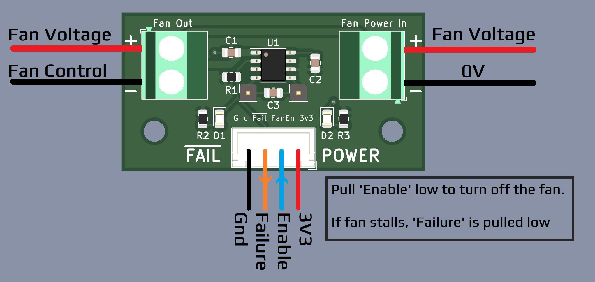

# Fan Failure Detection Board
This board is able to detect a stalled fan and set an output to trigger external actions.

## Overview
This board uses the MAX6684 IC and some support parts to detect the current flowing through the fan and sets outputs based on disruptions in that current flow. By varying the value of capacitor `C3` the system can be tuned for different fans. "Because  of  the  complexity  of  fan-current  waveforms, the  value  of  CF has  to  be  arrived  at  empirically  and must  be  verified  by  bench  testing." [From the datasheet](https://www.analog.com/media/en/technical-documentation/data-sheets/max6684.pdf). The datasheet recommends 0.1uF as the starting point

### Setup
To use, connect your fan to the "Fan Out" connector, fan power supply to "Fan Power In", and 3v3/Gnd to the 4 pin JST header. The fan will turn on automatically when 3v3 is applied. To turn the fan off, pull the fan enable pin "FanEn" low. When the fan enters a locked-rotor condition, the Fail pin "~{Fail}" is pulled low.

## BOM

| Reference | Description  |                            Note                               | Quantity |   LCSC  |
|   :---:   |     :---:    |                            :---:                              |  :---:   |  :---:  |
|  C1, C3   |    0.1 uF    |                      C_0805_2012Metric                        |     2    | C49678  |
|    C2     |    1 uF      |                      C_0805_2012Metric                        |     1    | C28323  |
|  R2, R3   |    1K        |                      R_0805_2012Metric                        |     2    | C17513  |
|    R1     |    10K       |                      R_0805_2012Metric                        |     1    | C17414  |
|  D1, D2   |    LED       |                     LED_0805_2012Metric                       |     2    | C84256  |
|    U1     |    MAX6684   |                  SO-8_3.9x4.9mm_P1.27mm                       |     1    | C143563 |
|    J1     |  Conn_01x04  |             JST_XH_B4B-XH-A_1x04_P2.50mm_Vertical             |     1    | C144395 |
|  J2, J3   | Fan, PowerIn | TerminalBlock_Phoenix_MKDS-1,5-2-5.08_1x02_P5.08mm_Horizontal |     2    |  C8465  |
|  J4, J5   |    FC-, FC+  |                PinHeader_1x01_P2.54mm_Vertical                |     2    | C492400 |

### [Interactive BOM](http://htmlpreview.github.io/?https://github.com/timmit99/Fan_Stall_Detector/blob/main/iBOM/FanStallDetector.html)
